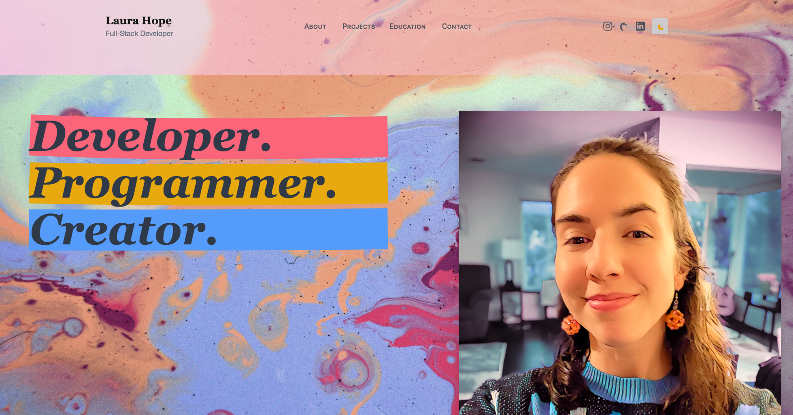

# Capstone Portfolio

#### By **Laura Hope**

## Live Link via Vercel
https://lauramhope-portfolio.vercel.app/


## Technologies Used

* _Git_
* _JavaScript / JSX_
* _HTML / CSS_
* _React v 18.2.0_
* _Tailwind v 3.3.3_
* _Next.js v 13.4.10_
* _Axios v 1.4.0_
* _Bootstrap v 5.3.0_
* _Next themes_

## Description
_This application displays a professional portfolio website using React, Next.js, and TailwindCSS for various informative pages and styling. GitHub API implemented using Axios to fetch the latest code from my personal repository. Includes toggling between dark and light mode via Next-themes._

## Setup/Installation Requirements

* _Clone the repository ```CapPortfolio``` to your desktop._
* _Open your shell (e.g., Terminal or GitBash) and navigate to this project's production directory titled ```portfolio-project```_
* _In your terminal or GitBash, type ```npm install`` for installing necessary dependencies to run this application_
* _Enter ```npm run start``` to have browser access with application running_
    * If this command doesn't automatically open the web page, you can enter http://localhost:3000/ in the browser to access application
* _Can also go directly to hosted website on Vercel: ```https://lauramhope-portfolio.vercel.app/```_

## Known Bugs

* _No known bugs as of 7/27/23_

## License

_MIT License_

Permission is hereby granted, free of charge, to any person obtaining a copy
of this software and associated documentation files (the "Software"), to deal
in the Software without restriction, including without limitation the rights
to use, copy, modify, merge, publish, distribute, sublicense, and/or sell
copies of the Software, and to permit persons to whom the Software is
furnished to do so, subject to the following conditions:

The above copyright notice and this permission notice shall be included in all
copies or substantial portions of the Software.

THE SOFTWARE IS PROVIDED "AS IS", WITHOUT WARRANTY OF ANY KIND, EXPRESS OR
IMPLIED, INCLUDING BUT NOT LIMITED TO THE WARRANTIES OF MERCHANTABILITY,
FITNESS FOR A PARTICULAR PURPOSE AND NONINFRINGEMENT. IN NO EVENT SHALL THE
AUTHORS OR COPYRIGHT HOLDERS BE LIABLE FOR ANY CLAIM, DAMAGES OR OTHER
LIABILITY, WHETHER IN AN ACTION OF CONTRACT, TORT OR OTHERWISE, ARISING FROM,
OUT OF OR IN CONNECTION WITH THE SOFTWARE OR THE USE OR OTHER DEALINGS IN THE
SOFTWARE.

_Copyright (c) 2023 Laura Hope_

_If you run into any issues or have questions, ideas or concerns, please reach out via email: lauramhope.dpt@gmail.com.  Contributions to the code are highly encouraged._